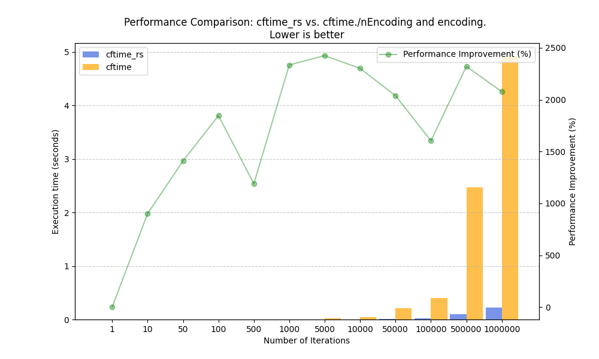
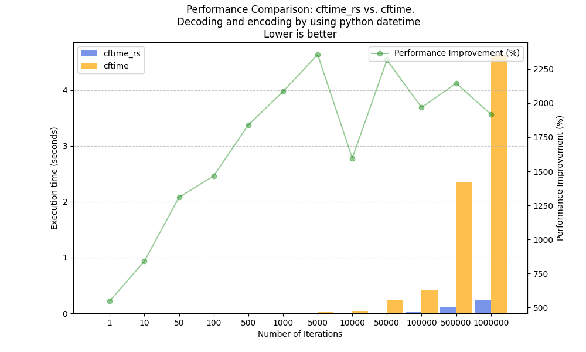

# `cftime-rs`

`cftime-rs` is an implementation in `rust` of the [cf time](https://cfconventions.org/Data/cf-conventions/cf-conventions-1.10/cf-conventions.html#time-coordinate) convention. Python bindins are available for this project and use the great [maturin library](https://www.maturin.rs/). The python bindings are highly inspired by the [cftime](https://github.com/Unidata/cftime/tree/master) python package developped by [Unidata](https://github.com/Unidata). 

<p align="center">
    <a href="https://github.com/antscloud/cftime-rs/actions">
        
    </a>
    <a href="https://crates.io/crates/cftime-rs">
        
    </a>
    <a href="https://pypi.org/project/cftime-rs/">
        
    </a>
    <a href="https://github.com/antscloud/cftime-rs/actions">
        
    </a>
    <a href="https://www.gnu.org/licenses/agpl-3.0">
        
    </a>
    <a href="https://cftime-rs.readthedocs.io/en/latest">
        
    </a>
    <a href="https://github.com/antscloud/cftime-rs/issues">
        
    </a>
    <a href="https://github.com/antscloud/cftime-rs/pulls">
        
    </a>
</p>

<p align="center">
    <b>Documentation</b> :
    <a href="https://docs.rs/cftime-rs/latest/cftime_rs/">Rust</a>
    |
    <a href="https://cftime-rs.readthedocs.io/en/latest/">Python</a>
    <br>
    <b>Packages</b> :
    <a href="https://crates.io/crates/cftime-rs">Rust</a>
    |
    <a href="https://pypi.org/project/cftime-rs/">Python</a>
    <br>
    <b>Repository</b> :
    <a href="https://github.com/antscloud/cftime-rs">Github</a>
</p>


## Rust
### Installation

```
cargo install cftime-rs
```

### Examples 

#### Decoding 

Decoding needs units, and calendar and can work with `i32`, `i64`, `f32`, ``f64`` and their corresponding vector type `Vec<i32>`, `Vec<i64>`, `Vec<f32>` and `Vec<f64>`. From these type it return either a `CFDatetime` object or a `Vec<CFDatetime>`.

```rust
use cftime_rs::calendars::Calendar;
use cftime_rs::decoder::*;
use std::str::FromStr;
fn main() {
    let to_decode = vec![0, 1, 2, 3, 4, 5];
    let units = "days since 2000-01-01 00:00:00";
    let calendar = Calendar::from_str("standard").unwrap();
    let datetimes = to_decode.decode_cf(units, calendar).unwrap();
    for datetime in datetimes {
        println!("{}", datetime);
    }
}
```

will print :

```
2000-01-01 00:00:00.000
2000-01-02 00:00:00.000
2000-01-03 00:00:00.000
2000-01-04 00:00:00.000
2000-01-05 00:00:00.000
2000-01-06 00:00:00.000
```

#### Encoding 

Encoding needs units and calendar and can convert a `CFDatetime` object into an `i32`, `i64`, `f32` or  `f64` or a `Vec<CFDatetime>` into `Vec<i32>`, `Vec<i64>`, `Vec<f32>` or `Vec<f64>`.

```rust
use cftime_rs::calendars::Calendar;
use cftime_rs::datetime::CFDatetime;
use cftime_rs::encoder::*;
use cftime_rs::errors::Error;
use std::str::FromStr;
fn main() {
    let calendar = Calendar::from_str("standard").unwrap();
    // Create vector of datetimes and convert Vec<Result<CFDatetime, Error>>
    // into Result<Vec<CFDatetime>, Error>
    let to_encode: Result<Vec<CFDatetime>, Error> = vec![
        CFDatetime::from_ymd(2000, 1, 1, calendar),
        CFDatetime::from_ymd(2000, 1, 2, calendar),
        CFDatetime::from_ymd(2000, 1, 3, calendar),
        CFDatetime::from_ymd(2000, 1, 4, calendar),
        CFDatetime::from_ymd(2000, 1, 5, calendar),
        CFDatetime::from_ymd(2000, 1, 6, calendar),
    ]
    .into_iter()
    .collect();
    // define the units
    let units = "days since 2000-01-01 00:00:00";
    // The type annotation for result allow us to cast to type we want
    // here we use Vec<i64>
    let results: Vec<i64> = to_encode.unwrap().encode_cf(units, calendar).unwrap();
    for result in results {
        println!("{}", result);
    }
}
```

will print :

```
0
1
2
3
4
5
```

## Python
### Installation

```
pip install cftime-rs
```

### Examples 


### Decoding to PyCfDatetimes

```python
import cftime_rs

to_decode = [0, 1, 2, 3, 4, 5]
units = "days since 2000-01-01 00:00:00"
calendar = "standard"
datetimes = cftime_rs.num2date(arr, units, calendar)
for datetime in datetimes:
    print(datetime)
```

will print :

```
2000-01-01 00:00:00.000
2000-01-02 00:00:00.000
2000-01-03 00:00:00.000
2000-01-04 00:00:00.000
2000-01-05 00:00:00.000
2000-01-06 00:00:00.000
```

### Encoding PyCFDatetimes

```python
calendar = cftime_rs.PyCFCalendar.from_str("standard")
to_encode = [
    cftime_rs.PyCFDatetime.from_ymd(2000, 1, 1, calendar),
    cftime_rs.PyCFDatetime.from_ymd(2000, 1, 2, calendar),
    cftime_rs.PyCFDatetime.from_ymd(2000, 1, 3, calendar),
    cftime_rs.PyCFDatetime.from_ymd(2000, 1, 4, calendar),
    cftime_rs.PyCFDatetime.from_ymd(2000, 1, 5, calendar),
    cftime_rs.PyCFDatetime.from_ymd(2000, 1, 6, calendar),
]
units = "days since 2000-01-01 00:00:00"
calendar = "standard"
numbers = cftime_rs.date2num(to_encode, units, calendar, dtype="int")
for number in numbers:
    print(number)
```

will print :

```
0
1
2
3
4
5
```

### Decoding to Python datetimes

```python
to_decode = [0, 1, 2, 3, 4, 5]
units = "days since 2000-01-01 00:00:00"
calendar = "standard"
datetimes = cftime_rs.num2pydate(to_decode, units, calendar)
for datetime in datetimes:
    print(datetime)
```
will print 

```
2000-01-01 00:00:00
2000-01-02 00:00:00
2000-01-03 00:00:00
2000-01-04 00:00:00
2000-01-05 00:00:00
2000-01-06 00:00:00
```

### Decoding Python datetimes

```python
to_encode = [
    dt.datetime(2000, 1, 1),
    dt.datetime(2000, 1, 2),
    dt.datetime(2000, 1, 3),
    dt.datetime(2000, 1, 4),
    dt.datetime(2000, 1, 5),
    dt.datetime(2000, 1, 6),
]
units = "days since 2000-01-01 00:00:00"
calendar = "standard"
numbers = cftime_rs.pydate2num(to_encode, units, calendar, dtype="int")
for number in numbers:
    print(number)
```

will print 

```
0
1
2
3
4
5
```

## Known issues
While this date calculation library can handle a wide range of dates, from approximately -291,672,107,014 BC to 291,672,107,014 AD, there are some performance considerations you should be aware of.
As you move further away from the reference date of 1970-01-01 00:00:00, the time of calculation increases. This is because the library needs to account for leap years in various calendars.

Here is an example of the computation of 1_000_000_000_000_000 seconds using the units "seconds since 2000-01-01 00:00:00" on my personal computer in release mode :

| Calendar          | Computation Time |
|-------------------|------------------|
| Standard Calendar | 44.470405ms      |
| Leap Day Calendar | 8.052179ms       |
| 360-Day Calendar  | 12.834µs         |

## Comparison with cftime

Here is a benchmark on my computer of three methods. This is not really rigorous but this is to give an idea.  

We are comparing cftime with cftime_rs. The first method involves decoding a series of numbers using the standard calendar, calling the .str() method, and then re-encoding them to the same unit and calendar. 
The second method is to decode a series of numbers using the standard calendar and re-encode them to the same unit and calendar without calling .str().
The third method is to decode a series of numbers using the standard calendar into python datetimes and re-encode them to the same unit and calendar without calling .str(). 

First and second methods are designed to be fair between the two libraries because cftime_rs only uses timestamps (i64) as its internal representation and never recalculates the year, month, day, hour, minutes, and seconds, except if you explicitly request this representation.


<div style="display: flex; align-items: center; justify-content: center">
    
    
</div>

<div style="display: flex; align-items: center; justify-content: center">
    
</div>